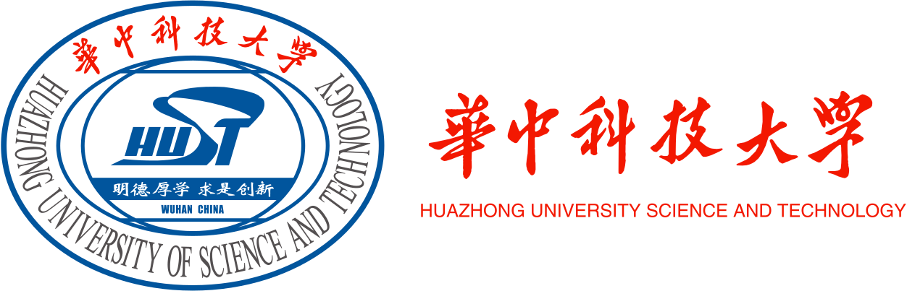

## About Me

I am an Associate Professor of the [School of Cyber Science and Engineering](http://cse.hust.edu.cn/), [Huazhong University of Science and Technology](http://english.hust.edu.cn/). Prior to joining HUST, I received my Ph.D. degree from the [University of Chinese Academy of Sciences](https://english.cas.cn/), under supervision of [Prof.Yuqing Zhang](http://people.ucas.ac.cn/~zhangyuqing?language=en) in 2021. I have also been visiting scholar in [Prof.Peng Liu](https://s2.ist.psu.edu/pliu/)’s cybersecurity lab at Penn State from 2018 to 2020.

My research interests cover a wide range of systems security, including trusted computing and IoT systems security. I am especially interested in developing automatic tools to detect and exploit previously unknown vulnerabilities in IoT firmware and platforms. 

### Opening:

I am looking for self-motivated master or Ph.D. students to work on cybersecurity problems, especially **IoT security**. 
Please send me your CV if interested. Candidates are expected to have a solid background in system programming and operating systems. 
If you are a HUST (undergraduate/master) student with interests in my areas, my lab is also welcome.