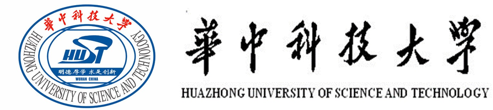

I am an Associate Professor of the School of Cyber Science and Engineering, Huazhong University of Science and Technology. My research interests cover a wide range of systems security, including trusted computing and IoT systems security. I am especially interested in developing automatic tools to detect and exploit previously unknown vulnerabilities in IoT firmware and platforms. My work helped many high-profile vendors improve their products’ security, including Alibaba, JD, Apple, Samsung, etc.

## Opening:

I am looking for self-motivated master or Ph.D. students to work on cybersecurity problems, especially IoT security. Please send me your CV if interested. Candidates are expected to have a solid background in system programming and operating systems. If you are a HUST (undergraduate/master) student and has interested in IoT security, my lab is also welcome.

 Download my CV.